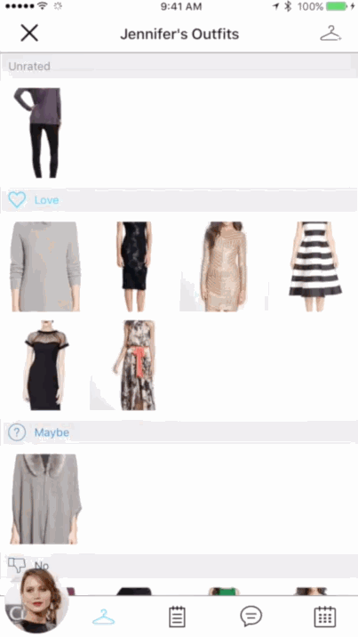
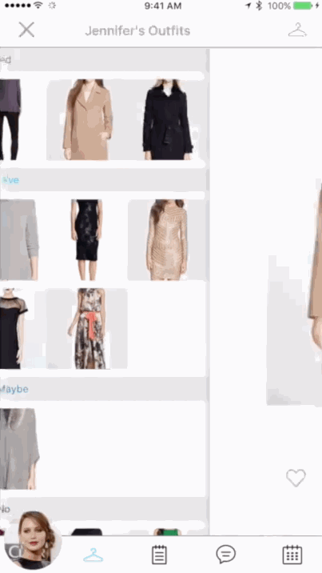

## Armoire Professional Personal Shopper CRM iOS App

[See a narrated video walkthrough here.](https://www.youtube.com/watch?v=skJIa3YuoLc)

### What Armoire Does
Armoire aims to be a CRM for personal shoppers running their own small businesses, as well as providing a platform for their clients to track their service and communicate with them in one location using the "profile" page and related communication pages provided. 

The core feature set for the stylist's is a list of their clients, profile pages that allow quick access to the most relevant facts about their clients (measurements, price range for different types of clothing, along with basic demographic data), a communication platform that provides an easy to follow history, notes for future reference about what works and doesn't work for the client, a camera that creates photos that are associated with the appropriate client, and the ability to create appointments (including providing a history of past appointments and notifying both client and stylist about upcoming appointments).

The client will only be able to access their own profile page, the communication page (with access only to their stylists), and the appointment tool. 

The above is the bare minimum that needs to be provided to ensure value is added through the Armoire application; further enhancements such as reminder notifications related to clients that are primed for further engagement, a billing feature, and a shipping feature would further establish the Armoire app as a valuable tool in this space.

### Features

#### Required (MVP)

- Business
  - [ ] SquareSpace.com/logo or some other icon
  - [ ] Choose tagline
  - [ ] Choose font
- (Personal Shopper's View) Client Management
  - Sign Up Page
    - [x] Designer can sign up
    - [x] Client can log in
    - [ ] If the client was invited they will have a text sent with code and url to download
      OR
    - [ ] the link to download auto-sets the email field
  - Clients Page
    - [x] list of clients which show their names
    - [x] click cell leads to individual profile page
  - Client Profile Page
    - [ ] include pic, phone, email, and other basic data (next time seen, money spent, began working with, etc)
    - [x] include measurements that can be modified by user (name, measurement, price range)
    - [x] can access and edit personal notes
  - Scheduler
    - [x] should see upcoming appointments and past appointment with time, location, and customer
    - [x] should be added to their phone calendar
    - [x] remind of upcoming appointments
  - Messaging
    - [x] message capacity in realtime between client and designer
    - [x] history of messaging history
  - Add Client
    - [x] Add a client which sends email to client with link to download the Armoire App
    - [ ] First check if client already exists, in which case notify them and allow process to associate them with the designer attempting to claim them
    - [x] If no client exists, create client and text them with a code that will confirm their identity and association to designer
  - Photo
    - [ ] Take Photo and associate it with a client
    - [ ] Icon on photo to indicate stylist took it

- (Client's View) Fashion Notes/History - Kind of like a medical record for clothes, but with ability to interact with personal shopper.
  - [x] same as above except limited to their specific profile page with specific components (like amount spent and personal stylist notes not available, though they should be able to create their own notes)

### Stretch Goals

- Notes 
  - [ ] can be associated with specific meeting, for both customer and client 
  - [x] Notes shareable
- Billing
  - [ ] start a timer with an associated hourly rate -> calculate final fee
  - [ ] send a request for payment to client
  - [ ] see history of payments and outstanding requests
- Reminders
  - [ ] reminder system that has toggles for common concern
  - [ ] haven't spoken to them in a while, but they logged in recently so reach out
  - [ ] bill overdue
  - [ ] sales
- Shipping
  - [ ] ships to clients seamlessly
    - [ ] print label option
    OR
    - [ ] integrate with ship or something similar

Credits
---------
* [Parse](http://parseplatform.org/)
* [Layer](http://layer.com/)
